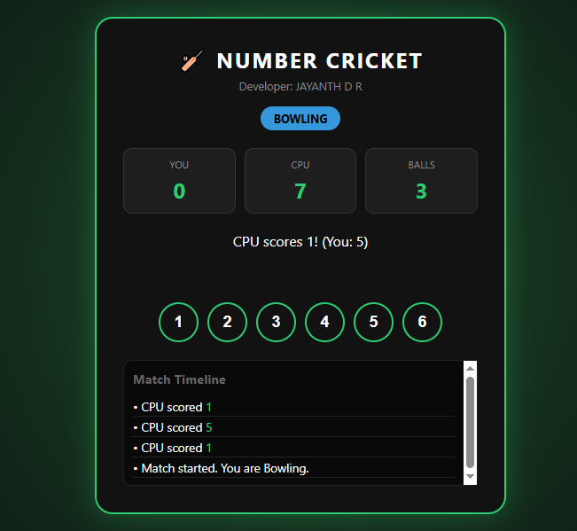

## 🏏 Number Cricket Pro
thhasgd
- Number Cricket Pro is a modern, web-based version of the classic "Hand Cricket" game. Originally conceived as a Java console application, this version brings the game to life with a sleek user interface, real-time match logging, and interactive toss mechanics.

## 📝 Description
- Challenge the CPU in a high-speed cricket match! The game uses a number-matching logic (1–6) to determine runs and wickets. With a built-in toss system and an automated second-innings target tracker, it provides a complete cricket experience in your browser.

## ✨ Features

- Interactive Toss: Choose Heads or Tails to start the match.
- Strategic Choice: If you win the toss, choose to Bat First or Bowl First.
- Live Scoreboard: Tracks runs, balls remaining, and the target to beat.
- Match Timeline: A scrollable log recording every play, out, and milestone.
- Responsive Design: Sporty dark-themed UI that works on both desktop and mobile.
- Smart AI: A randomized CPU opponent that adapts to your play style.
---

##  Screenshots

### Home Screen

---

## 🎮 How to Play

- The Toss: Start by calling Heads or Tails.
- The Choice: If you win, select whether you want to bat or bowl. If the CPU wins, it will decide for you!
- Gameplay: Click numbers 1 through 6 to play your turn.
- While Batting: If your number matches the CPU's, you are OUT. Otherwise, your number is added to your score.
- While Bowling: If your number matches the CPU's, you take a WICKET. Otherwise, the CPU adds its number to its score.
- Winning: The game ends after both innings are complete (6 balls each or a wicket). The player with the highest score wins!

## 🛠️ Built With
- HTML5 - Semantic structure.
- CSS3 - Custom properties, Flexbox/Grid, and UI transitions.
- JavaScript (ES6) - State management and event-driven logic.

## 👤 Developer
**JAYANTH D R**
